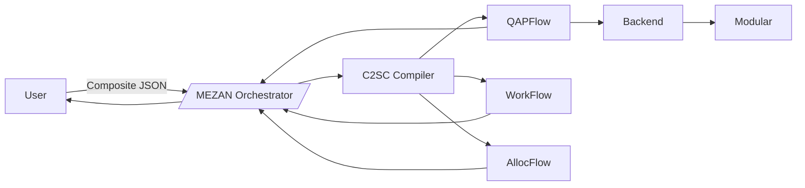

# MEZAN Monorepo

This repository contains two main projects and consolidated documentation:

- ATLAS (framework and examples): `ATLAS/`
- Libria (meta-algorithm selection research): `Libria/`
- Documentation index: `docs/README.md`

Quick Links
- Start here: `START_HERE.md` (root) → now points to `MEZAN/`
- Docs index: `docs/README.md`
- MEZAN docs: `MEZAN/README.md`, `MEZAN/ARCHITECTURE.md`
- ATLAS quick start: `ATLAS/README.md` (if present)
- Libria quick start: `Libria/libria-meta/README.md`
- Web UI (local): `/ui`, `/bench/ui`, `/bench/ui/new`, `/bench/reports/index`

Repository Conventions
- See `REPO_CONVENTIONS.md` for structure, naming, and cleanup plan.
- Contributing: `CONTRIBUTING.md`, `CODE_OF_CONDUCT.md`

Issue Backlog Import (GitHub)
- Generate a CSV of issues from the QAPFlow TODO and overall backlog:
  - `make -C Libria/libria-meta issues-csv`
- Import `issues.csv` into your GitHub repository via the Issues CSV import tool.

Architecture (Visual)

Repository Trees
- Run: `python scripts/gen_tree_md.py` to generate tree docs under `docs/TREE.md` and `Libria/libria-meta/docs/REPO_TREE.md`.
