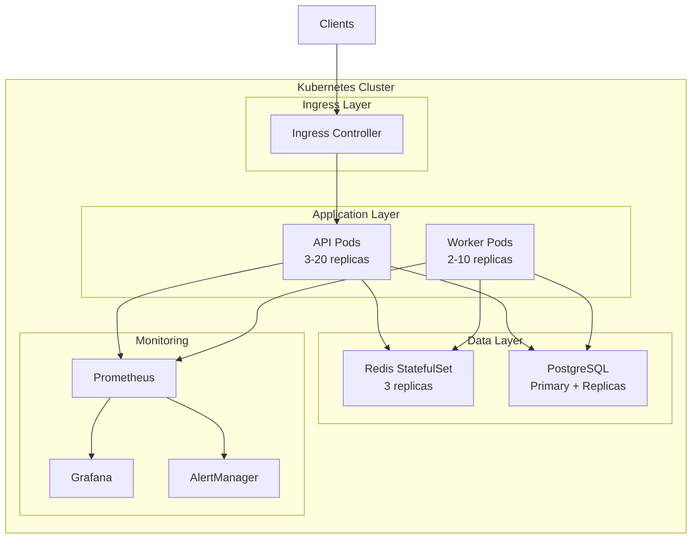

# MEZAN ATLAS Kubernetes Deployment Guide

## Table of Contents
1. [Overview](#overview)
2. [Prerequisites](#prerequisites)
3. [Architecture](#architecture)
4. [Deployment Methods](#deployment-methods)
5. [Configuration](#configuration)
6. [Operations](#operations)
7. [Troubleshooting](#troubleshooting)
8. [Security](#security)

## Overview

MEZAN ATLAS is deployed on Kubernetes as a cloud-native, microservices-based application with automatic scaling, high availability, and comprehensive monitoring.

### Key Components
- **API Server**: Flask-based REST API handling orchestration requests
- **Worker Pods**: Background processing for agent tasks
- **Redis Cluster**: Distributed cache and message broker
- **PostgreSQL**: Persistent storage for workflow state
- **Monitoring Stack**: Prometheus, Grafana, and alerting

## Prerequisites

### Required Tools
```bash
# Kubernetes CLI
kubectl version --client
# Expected: v1.28+

# Helm
helm version
# Expected: v3.13+

# Kustomize
kustomize version
# Expected: v5.0+

# Optional: kubectx for context switching
kubectx --version
```

### Cluster Requirements
- Kubernetes 1.28+
- 3+ nodes with 4 CPU, 16GB RAM minimum
- Storage classes: `fast-ssd`, `standard`
- Ingress controller (nginx-ingress recommended)
- Metrics server installed
- DNS configured

## Architecture



## Deployment Methods

### Method 1: Using Raw Kubernetes Manifests

```bash
# Deploy base manifests
kubectl apply -k MEZAN/ATLAS/atlas-core/k8s/base/

# Check deployment
kubectl get all -n mezan-atlas
```

### Method 2: Using Kustomize Overlays

```bash
# Development environment
kubectl apply -k MEZAN/ATLAS/atlas-core/k8s/overlays/dev/

# Staging environment
kubectl apply -k MEZAN/ATLAS/atlas-core/k8s/overlays/staging/

# Production environment
kubectl apply -k MEZAN/ATLAS/atlas-core/k8s/overlays/production/
```

### Method 3: Using Helm (Recommended)

```bash
# Add dependencies
helm dependency update MEZAN/ATLAS/atlas-core/helm/

# Development
helm install mezan-atlas MEZAN/ATLAS/atlas-core/helm/ \
  --namespace mezan-atlas-dev \
  --create-namespace \
  --values MEZAN/ATLAS/atlas-core/helm/values.yaml \
  --set environment=development

# Production
helm install mezan-atlas MEZAN/ATLAS/atlas-core/helm/ \
  --namespace mezan-atlas-production \
  --create-namespace \
  --values MEZAN/ATLAS/atlas-core/helm/values-prod.yaml \
  --set-string secrets.anthropicApiKey=$ANTHROPIC_API_KEY \
  --set-string secrets.openaiApiKey=$OPENAI_API_KEY
```

## Configuration

### Essential Environment Variables

```yaml
# ConfigMap settings
FLASK_ENV: production
ATLAS_ENGINE_MODE: production
ATLAS_MAX_AGENTS: "20"
REDIS_HOST: redis-service
REDIS_PORT: "6379"

# Secrets (base64 encoded)
ANTHROPIC_API_KEY: <base64>
OPENAI_API_KEY: <base64>
REDIS_PASSWORD: <base64>
JWT_SECRET_KEY: <base64>
```

### Resource Allocation

```yaml
# API Server
resources:
  requests:
    cpu: 500m
    memory: 1Gi
  limits:
    cpu: 2000m
    memory: 4Gi

# Worker
resources:
  requests:
    cpu: 1000m
    memory: 2Gi
  limits:
    cpu: 4000m
    memory: 8Gi
```

### Autoscaling Configuration

```yaml
# Horizontal Pod Autoscaler
spec:
  minReplicas: 3
  maxReplicas: 20
  metrics:
  - type: Resource
    resource:
      name: cpu
      target:
        type: Utilization
        averageUtilization: 70
  - type: Resource
    resource:
      name: memory
      target:
        type: Utilization
        averageUtilization: 80
```

## Operations

### Deployment Operations

```bash
# Check deployment status
kubectl rollout status deployment/mezan-atlas-api -n mezan-atlas

# Scale manually
kubectl scale deployment/mezan-atlas-api --replicas=5 -n mezan-atlas

# Update image
kubectl set image deployment/mezan-atlas-api \
  mezan-api=mezan-atlas:3.5.1 -n mezan-atlas

# Rollback
kubectl rollout undo deployment/mezan-atlas-api -n mezan-atlas

# View history
kubectl rollout history deployment/mezan-atlas-api -n mezan-atlas
```

### Monitoring

```bash
# View logs
kubectl logs -f deployment/mezan-atlas-api -n mezan-atlas

# Tail all pods
kubectl logs -f -l app.kubernetes.io/name=mezan-atlas -n mezan-atlas

# View metrics
kubectl top pods -n mezan-atlas
kubectl top nodes

# Port forward to Grafana
kubectl port-forward svc/grafana 3000:3000 -n mezan-atlas

# Port forward to Prometheus
kubectl port-forward svc/prometheus 9090:9090 -n mezan-atlas
```

### Backup and Restore

```bash
# Trigger manual backup
kubectl create job --from=cronjob/mezan-atlas-backup \
  manual-backup-$(date +%s) -n mezan-atlas

# List backups
kubectl exec -it redis-0 -n mezan-atlas -- redis-cli BGSAVE

# Database backup
kubectl exec -it postgres-0 -n mezan-atlas -- \
  pg_dump -U mezan_admin mezan_atlas > backup.sql
```

### Debugging

```bash
# Execute into pod
kubectl exec -it deployment/mezan-atlas-api -n mezan-atlas -- /bin/bash

# Debug pod
kubectl debug deployment/mezan-atlas-api -n mezan-atlas \
  --image=busybox --target=mezan-api

# View events
kubectl get events -n mezan-atlas --sort-by='.lastTimestamp'

# Describe pod
kubectl describe pod <pod-name> -n mezan-atlas

# Check resource usage
kubectl describe resourcequota -n mezan-atlas
```

## Troubleshooting

### Common Issues

#### 1. Pods Not Starting

```bash
# Check pod status
kubectl get pods -n mezan-atlas -o wide

# View pod events
kubectl describe pod <pod-name> -n mezan-atlas

# Check logs
kubectl logs <pod-name> -n mezan-atlas --previous
```

#### 2. OOMKilled Pods

```bash
# Increase memory limits
kubectl edit deployment mezan-atlas-api -n mezan-atlas

# Or using Helm
helm upgrade mezan-atlas ./helm \
  --set api.resources.limits.memory=8Gi
```

#### 3. Connection Issues

```bash
# Test Redis connectivity
kubectl run redis-test --rm -it --image=redis:alpine \
  -- redis-cli -h redis-service ping

# Test API connectivity
kubectl run curl-test --rm -it --image=curlimages/curl \
  -- curl http://mezan-atlas-api:5000/health
```

#### 4. Storage Issues

```bash
# Check PVC status
kubectl get pvc -n mezan-atlas

# Check available storage
kubectl get storageclass

# Expand PVC (if supported)
kubectl edit pvc redis-data-redis-0 -n mezan-atlas
```

### Performance Tuning

```bash
# Enable VPA recommendations
kubectl describe vpa mezan-atlas-api-vpa -n mezan-atlas

# Check HPA status
kubectl get hpa -n mezan-atlas --watch

# Analyze resource usage
kubectl top pods -n mezan-atlas --containers
```

## Security

### RBAC Configuration

```yaml
# ServiceAccount with minimal permissions
apiVersion: v1
kind: ServiceAccount
metadata:
  name: mezan-atlas-sa
  namespace: mezan-atlas

---
apiVersion: rbac.authorization.k8s.io/v1
kind: Role
metadata:
  name: mezan-atlas-role
  namespace: mezan-atlas
rules:
- apiGroups: [""]
  resources: ["pods", "services"]
  verbs: ["get", "list", "watch"]
```

### Network Policies

```yaml
# Restrict ingress/egress
apiVersion: networking.k8s.io/v1
kind: NetworkPolicy
metadata:
  name: mezan-atlas-netpol
  namespace: mezan-atlas
spec:
  podSelector:
    matchLabels:
      app: mezan-atlas
  policyTypes:
  - Ingress
  - Egress
  ingress:
  - from:
    - namespaceSelector:
        matchLabels:
          name: ingress-nginx
  egress:
  - to:
    - namespaceSelector: {}
```

### Secret Management

```bash
# Using Sealed Secrets
kubeseal --format=yaml < secret.yaml > sealed-secret.yaml

# Using External Secrets Operator
kubectl apply -f external-secret.yaml

# Rotate secrets
kubectl create secret generic mezan-atlas-secrets \
  --from-literal=ANTHROPIC_API_KEY=$NEW_KEY \
  --dry-run=client -o yaml | kubectl apply -f -
```

### Pod Security Standards

```yaml
securityContext:
  runAsNonRoot: true
  runAsUser: 1000
  fsGroup: 1000
  seccompProfile:
    type: RuntimeDefault

containerSecurityContext:
  allowPrivilegeEscalation: false
  readOnlyRootFilesystem: true
  capabilities:
    drop:
    - ALL
```

## Best Practices

1. **Use Namespaces**: Separate environments using namespaces
2. **Resource Limits**: Always set resource requests and limits
3. **Health Checks**: Configure liveness, readiness, and startup probes
4. **Autoscaling**: Use HPA for automatic scaling
5. **Monitoring**: Deploy comprehensive monitoring stack
6. **Backup Strategy**: Regular automated backups
7. **Security**: Follow least privilege principle
8. **Documentation**: Keep deployment docs updated

## Maintenance

### Regular Tasks

```bash
# Weekly: Review resource usage
kubectl top pods -n mezan-atlas --sum

# Monthly: Update dependencies
helm dependency update ./helm

# Quarterly: Disaster recovery test
kubectl delete pod -l app=mezan-atlas -n mezan-atlas

# Annually: Certificate renewal
kubectl get certificate -n mezan-atlas
```

### Upgrade Procedure

```bash
# 1. Backup current state
kubectl get all -n mezan-atlas -o yaml > backup.yaml

# 2. Test in staging
helm upgrade --install mezan-atlas-staging ./helm \
  --namespace mezan-atlas-staging \
  --values values-staging.yaml \
  --dry-run --debug

# 3. Production upgrade with rollback option
helm upgrade mezan-atlas ./helm \
  --namespace mezan-atlas-production \
  --values values-prod.yaml \
  --atomic \
  --cleanup-on-fail \
  --timeout 10m

# 4. Verify
kubectl get pods -n mezan-atlas-production
kubectl run smoke-test --rm -it --image=curlimages/curl \
  -- curl http://mezan-atlas-api:5000/health
```

## Support

For issues or questions:
- GitHub Issues: https://github.com/AlaweinOS/MEZAN/issues
- Email: meshal@berkeley.edu
- Documentation: https://docs.mezan-atlas.example.com